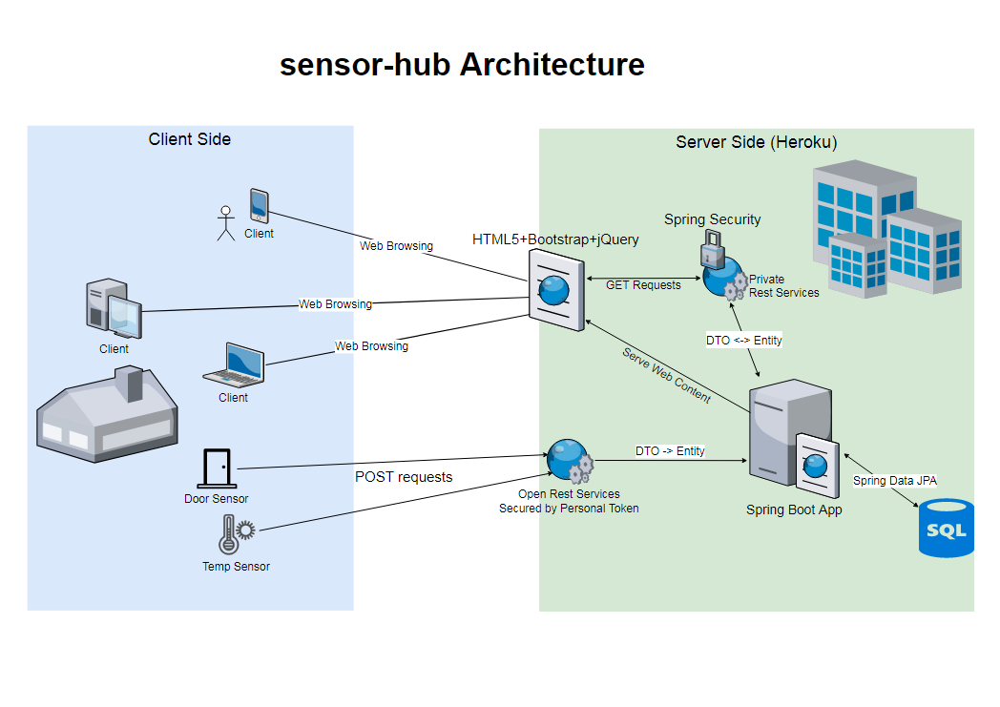

# sensor-hub
Web app for sensor data collection and representation in Spring Boot + Bootstrap 4. 
It is prepared to be deployed in Heroku with a PostgreSQL database. 
There are four application.properties files. One for development (configuration hardcoded in the file) 
and three for Heroku enviroments (configuration taken from config vars).

For development enviroment you can use the default embedded H2 database or switch to a PostgreSQL database (please check properties file). 
You need to set up your email address and password for the email sender class to work.

How to run: *mvn spring-boot:run -Drun.jvmArguments="-Dsign-up-enabled=1" -Drun.profiles=development*

Arquitecture:

Dependencies loaded:

**spring-boot-starter-web:**
Starter for building web, including RESTful, applications using Spring MVC. Uses Tomcat as the default embedded container

**spring-boot-starter-data-rest:**
Starter for exposing Spring Data repositories over REST using Spring Data REST

**spring-boot-starter-data-jpa:**
Starter for using Spring Data JPA with Hibernate

**postgresql:**
Provides PostgreSQL database support.

**h2:**
Provides H2 database support.

**spring-boot-starter-security:**
To include Spring Security

**spring-boot-starter-mail:**
Java Mail and Spring Framework's email sending support

**spring-boot-starter-thymeleaf:**
Add support for Thymeleaf views in MVC web applications 

**spring-boot-starter-test:**
Starter for testing Spring Boot applications with libraries including JUnit, Hamcrest and Mockito

**spring-boot-devtools:**
Includes some tools for development like auto deploy when code changes
    
**Presentation layer:**
  * Bootstrap 4
  * Bootstrap Toggle
  * jQuery
  * jQueryUI Datepicker 
